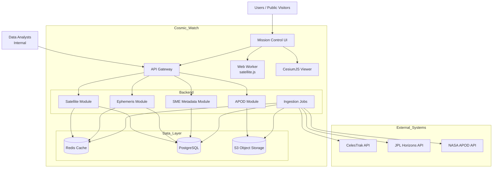
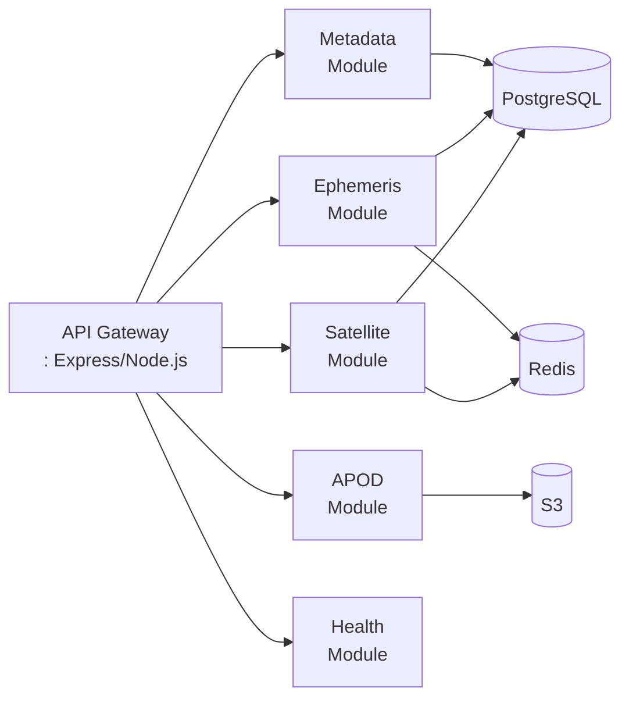
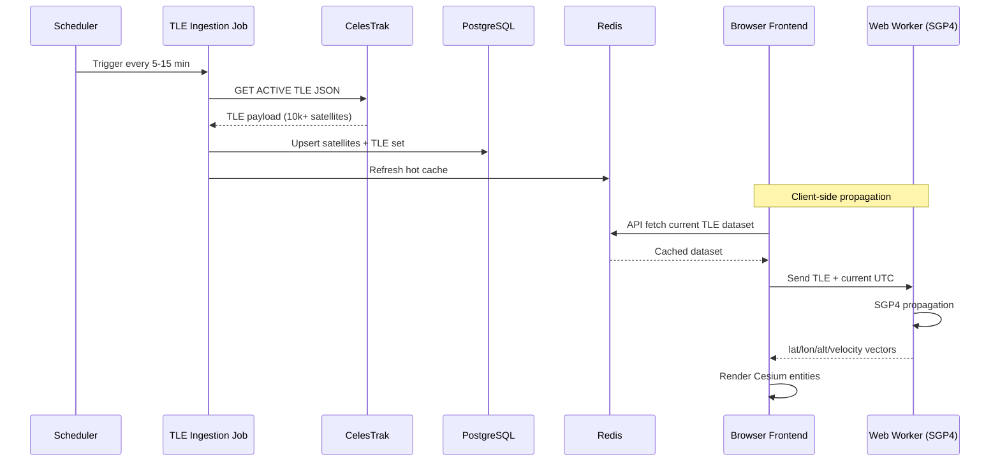
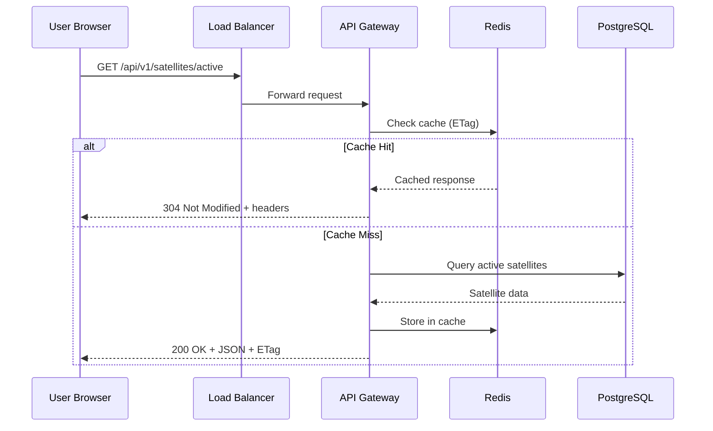
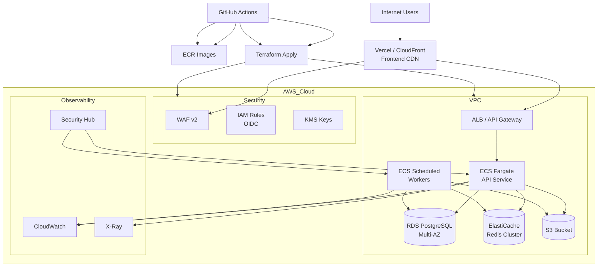
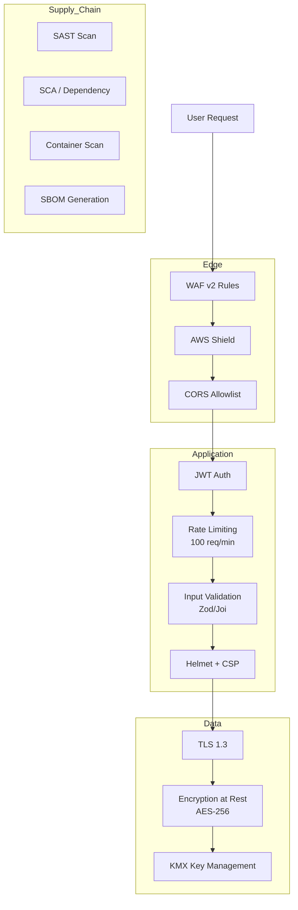

# Cosmic Watch - Architecture Diagrams

**Document ID:** CW-002  
**Related:** CW-001 (MVP Scope & NFRs)  
**Status:** Draft - Ready for Review  
**Date:** 2026-03-06

---

## 1. System Context Diagram

### 1.1 High-Level Context

### 1.2 External Data Sources

| Source | Purpose | Data Type |
|--------|---------|-----------|
| CelesTrak | Active satellite TLE data | Two-line elements |
| JPL Horizons | Solar system ephemeris | Position/velocity vectors |
| NASA APOD | Astronomy picture of the day | Image + metadata |

---

## 2. Component Diagram (Backend Modules)

### 2.1 API Gateway Modules

### 2.2 Module Responsibilities

| Module | Responsibility | Key Endpoints |
|--------|---------------|---------------|
| **Satellite** | TLE data, active satellite list, telemetry | `/satellites/active`, `/satellites/:noradId`, `/satellites/:noradId/telemetry` |
| **Ephemeris** | Solar system bodies, positions, distances | `/solar/bodies`, `/solar/positions`, `/solar/distance` |
| **Metadata** | SME-curated satellite info | `/metadata/satellites/:noradId`, PUT for updates |
| **APOD** | NASA picture of the day | `/apod/today` |
| **Health** | Liveness/readiness checks | `/health/live`, `/health/ready` |

---

## 3. Data Flow Diagram (Satellite Tracking)

### 3.1 Ingestion Flow

### 3.2 API Request Flow

---

## 4. Deployment Topology

### 4.1 Infrastructure Diagram

### 4.2 Environment Strategy

| Environment | Purpose | Configuration |
|-------------|---------|---------------|
| `dev` | Development testing | Single AZ, minimal scaling, relaxed security |
| `staging` | Release candidate testing | Production-like, reduced capacity |
| `prod` | Production traffic | Multi-AZ, full security, autoscaling |

---

## 5. Security Architecture

### 5.1 Security Layers

---

## 6. Component Legend

| Symbol | Meaning |
|--------|---------|
| `[Name]` | Service/Component |
| `[(Name)]` | Database/Storage |
| `-->` | Data Flow |
| `subgraph` | Logical grouping |

---

## 7. Technology Stack Summary

| Layer | Technology |
|-------|------------|
| Frontend | React + TypeScript + CesiumJS |
| Propagation | satellite.js (Web Worker) |
| API Gateway | Node.js + Express + TypeScript |
| Database | PostgreSQL (RDS) |
| Cache | Redis (ElastiCache) |
| Object Storage | S3 |
| Infrastructure | AWS (ECS Fargate, Terraform) |
| CI/CD | GitHub Actions + OIDC |
| Security | WAF, KMS, IAM |

---

## 8. Review Checklist

- [ ] Context diagram accurately represents all external dependencies
- [ ] Component diagram reflects modular monolith boundaries
- [ ] Deployment topology matches environment strategy
- [ ] Security layers cover all required controls
- [ ] Data flows are consistent with API contracts
- [ ] All leads have reviewed and provided feedback

---

**Diagrams Version:** 1.0  
**Reviewers:** Engineering Lead, Architecture, SecOps, DevOps
