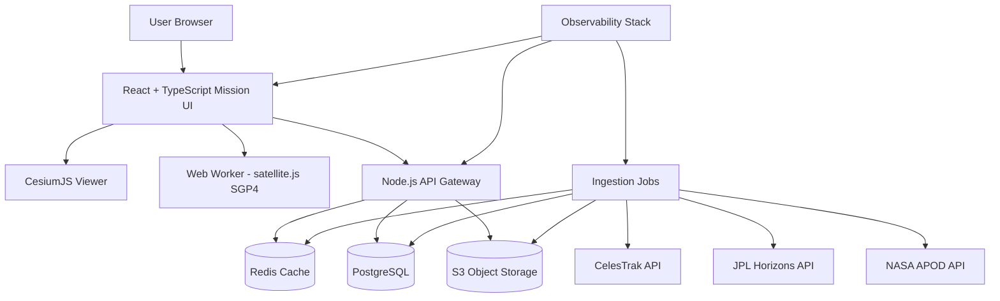
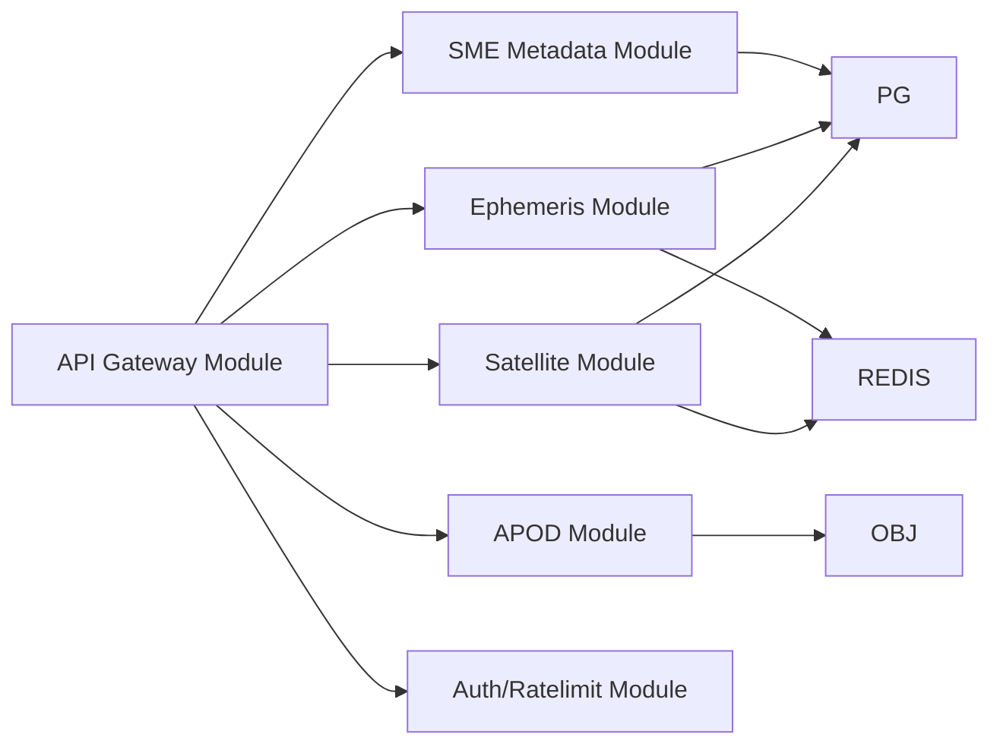
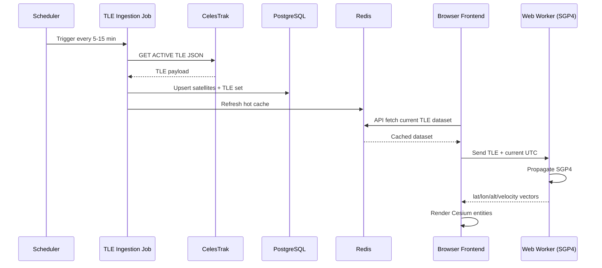
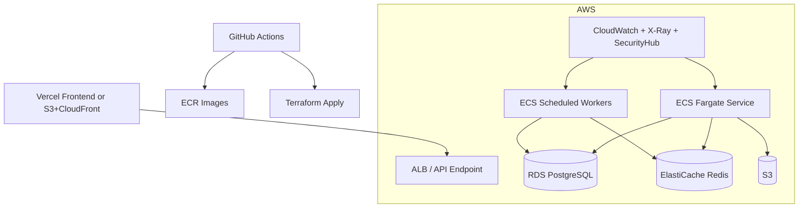

# Cosmic Watch - Full Kickstart Plan

## 0) Document Control
- Project: Cosmic Watch (Geospatial Digital Twin Mission Control)
- Version: v1.0
- Status: Draft for Kickoff
- Date: 2026-03-05
- Owner: DevSecOps + Architecture
- Audience: Engineering, Product, Data Analyst, Security, Ops

## 1) Executive Summary
Cosmic Watch will be a professional-grade, real-time mission dashboard that visualizes:
- All active Earth-orbit satellites using live TLE data + SGP4 propagation.
- Solar system bodies using JPL Horizons ephemeris.
- Curated mission metadata via an SME side panel.

The delivery strategy is:
- Start with a modular monolith backend + event-driven ingestion jobs.
- Keep rendering and orbital propagation optimized for browser performance with Web Workers.
- Enforce DevSecOps guardrails from day one (SAST, SCA, IaC scanning, SBOM, signed artifacts, runtime monitoring).
- Deploy with environment isolation and production SLOs.

## 2) Mission, Goals, and Non-Goals

### 2.1 Mission
Build an accurate, secure, and scalable digital twin of near-Earth orbit + solar system context for real-time situational awareness.

### 2.2 Business/Product Goals
- Deliver trustworthy orbital visualization that updates in near real time.
- Enable expert and non-expert users to inspect satellites and understand mission context quickly.
- Establish production-ready platform discipline (security, reliability, observability, compliance-ready processes).

### 2.3 Technical Goals
- Render >10,000 orbital objects with smooth interaction.
- Keep position drift under acceptable operational thresholds using frequent recomputation.
- Provide API p95 latency under 250ms for cached query endpoints.
- Reach 99.9% uptime for public dashboard service.

### 2.4 Non-Goals (Phase 1)
- Not a physics simulator for long-range orbital prediction beyond TLE precision limits.
- Not a defense-grade command-and-control system.
- No authenticated multi-tenant enterprise workspaces in first release.
- No mobile-native app in first release (responsive web only).

## 3) Scope Definition

### 3.1 In Scope (MVP -> v1)
- 3D globe + orbital tracks in CesiumJS.
- Live active satellites from CelesTrak (`GROUP=ACTIVE`).
- ISS highlighted with model and focused telemetry card.
- Solar system navigator with Sun/Moon/planets and fly-to navigation.
- Earth-to-planet live distance calculator.
- SME panel for satellite metadata (owner, mission type, altitude, velocity).
- APOD-powered splash module.
- Backend ingestion, cache, normalization, and API gateway.
- Production deployment, CI/CD, security baseline, observability stack.

### 3.2 Out of Scope (for later)
- Collision risk analytics.
- Satellite maneuver detection.
- User accounts, saved views, RBAC dashboards.
- Historical replay timeline over months/years.

## 4) Architecture Pattern Decision

### 4.1 Selected Pattern
Modular Monolith backend with job workers and clear module boundaries.

### 4.2 Why this pattern now
- Team size and early product maturity favor low operational complexity.
- Strong internal boundaries allow future extraction of services (ephemeris, metadata, ingestion) when scale/team requires.
- Faster initial delivery than full microservices while preserving architecture discipline.

### 4.3 Service Extraction Triggers
Extract a module to independent service when one or more triggers occur:
- Sustained module-specific load causes scaling imbalance.
- Release cadence differs significantly from core API.
- Team ownership needs independent deployment velocity.
- Security/compliance isolation needed for a specific function.

## 5) Architecture Decision Records (Initial ADR Set)
- ADR-001: Use CesiumJS for WGS84 globe and orbital rendering.
- ADR-002: Use `satellite.js` SGP4 propagation in Web Workers for client-side high-frequency updates.
- ADR-003: Use Node.js + TypeScript API gateway with modular monolith design.
- ADR-004: Use PostgreSQL for normalized domain + metadata + sync audit logs.
- ADR-005: Use Redis for hot cache (TLE payloads, ephemeris snapshots, API response cache).
- ADR-006: Use AWS primary runtime for backend/data plane; Vercel optional for frontend static hosting.
- ADR-007: Use GitHub Actions + OIDC to AWS (no long-lived cloud credentials).
- ADR-008: Enforce DevSecOps pipeline gates (SAST/SCA/IaC/container scan + signed artifacts).

## 6) High-Level System Architecture

### 6.1 Context Diagram


### 6.2 Component Diagram (Backend Modules)


### 6.3 Real-Time Data Flow (Satellite)


### 6.4 Deployment Topology (Recommended)


## 7) Detailed Module Design

### 7.1 Frontend (Mission Control UI)
- Stack: React + TypeScript + Vite/Next.js (choose one; recommend Vite for fast local loop).
- Key subsystems:
  - `CesiumScene`: Earth + atmosphere + stars + entity layers.
  - `OrbitalWorkerBridge`: thread boundary for SGP4 compute.
  - `SatelliteLayerManager`: clustering, level-of-detail, color coding by mission type.
  - `SMESidePanel`: selected object telemetry + curated facts.
  - `SolarSystemNavigator`: body selection, fly-to behavior, distance display.
  - `GlobalClock`: synchronized UTC display and simulation tick.
- Performance controls:
  - Worker-based propagation batches.
  - Dynamic LOD and point simplification at wide zoom.
  - Update interval decoupled from render FPS (ex: recompute every 1-2 sec, render at 60fps).
  - Debounced selection and panel updates.

### 7.2 API Gateway
- Responsibilities:
  - Serve normalized TLE datasets.
  - Serve ephemeris snapshots and interpolation-ready data.
  - Serve satellite metadata and APOD content.
  - Apply rate limit and response caching.
- Interface style: REST JSON for MVP.
- Versioning: `/api/v1/...`.

### 7.3 Ingestion Jobs
- `tle-sync-job`:
  - Schedule: every 5-15 minutes.
  - Source: CelesTrak active group JSON.
  - Action: normalize, validate, upsert, cache refresh.
- `ephemeris-sync-job`:
  - Schedule: every 1 hour for near-term windows.
  - Source: JPL Horizons query API.
  - Action: pull state vectors for target bodies; persist snapshots.
- `apod-sync-job`:
  - Schedule: daily.
  - Source: NASA APOD.
  - Action: fetch metadata + media URL and cache latest.

### 7.4 Metadata Module
- SME data store for curated content:
  - Mission description, owner, mission class, notes, references.
- Supports editorial workflow for junior analyst contribution:
  - YAML/JSON repo-based content with schema validation.
  - Optional future admin UI.

## 8) Data Model (PostgreSQL)

### 8.1 Core Tables
- `satellites`
  - `norad_id` (PK)
  - `name`
  - `international_designator`
  - `operator_org`
  - `mission_type`
  - `country_code`
  - `is_active`
  - `created_at`, `updated_at`

- `tle_sets`
  - `id` (PK)
  - `norad_id` (FK -> satellites)
  - `epoch_utc`
  - `line1`
  - `line2`
  - `source`
  - `ingested_at`
  - unique(`norad_id`,`epoch_utc`)

- `satellite_metadata`
  - `norad_id` (PK/FK)
  - `summary`
  - `owner`
  - `mission_type`
  - `launch_date`
  - `status`
  - `fact_json`
  - `last_reviewed_at`

- `celestial_bodies`
  - `body_code` (PK)
  - `name`
  - `category` (sun/planet/moon/dwarf)

- `ephemeris_snapshots`
  - `id` (PK)
  - `body_code` (FK)
  - `timestamp_utc`
  - `frame`
  - `x_km`, `y_km`, `z_km`
  - `vx_kms`, `vy_kms`, `vz_kms`
  - unique(`body_code`,`timestamp_utc`)

- `source_sync_runs`
  - `id` (PK)
  - `source_name`
  - `started_at`, `completed_at`
  - `status` (success/failure/partial)
  - `records_in`, `records_out`
  - `error_summary`

### 8.2 Indexing Strategy
- `tle_sets(norad_id, epoch_utc DESC)` for latest lookup.
- `ephemeris_snapshots(body_code, timestamp_utc)` for interpolation windows.
- `source_sync_runs(source_name, started_at DESC)` for operator dashboards.

### 8.3 Retention Strategy
- Keep all distinct TLE epochs for 90 days (Phase 1), archive older rows to S3 parquet.
- Keep ephemeris snapshots for 180 days.
- Keep sync logs for 1 year.

## 9) API Contract (v1)

### 9.1 Satellite Endpoints
- `GET /api/v1/satellites/active`
  - Returns active list and latest TLE references.
- `GET /api/v1/satellites/:noradId`
  - Returns satellite profile + latest TLE + metadata.
- `GET /api/v1/satellites/:noradId/telemetry?at=ISO_UTC`
  - Returns propagated altitude/velocity/lat/lon for a target time.

### 9.2 Ephemeris Endpoints
- `GET /api/v1/solar/bodies`
- `GET /api/v1/solar/positions?at=ISO_UTC`
- `GET /api/v1/solar/distance?from=EARTH&to=MARS&at=ISO_UTC`

### 9.3 SME Endpoints
- `GET /api/v1/metadata/satellites/:noradId`
- `PUT /api/v1/metadata/satellites/:noradId` (protected)

### 9.4 Utility Endpoints
- `GET /api/v1/apod/today`
- `GET /api/v1/health/live`
- `GET /api/v1/health/ready`
- `GET /api/v1/version`

### 9.5 API Rules
- UTC timestamps only, ISO8601.
- Response includes `server_time_utc` for client drift checks.
- Default page size and hard limits to prevent abuse.
- ETag + Cache-Control for list endpoints.

## 10) Orbital Computation Strategy

### 10.1 Satellite Propagation
- Primary compute location: browser Web Worker (`satellite.js`).
- Why:
  - Removes backend bottleneck for per-frame/per-second propagation at scale.
  - Keeps live interaction smooth and cost predictable.
- Fallback path:
  - Backend propagation endpoint for selected object details or low-power clients.

### 10.2 Time Synchronization
- Client estimates drift from `server_time_utc` on each API response.
- If drift exceeds threshold (ex: >500ms), client corrects simulation clock.

### 10.3 Accuracy Guardrails
- Display a precision notice: "TLE-based SGP4, best for near-current orbit estimation."
- Recompute positions on every tick (1-2 sec), not static track playback.
- Refresh source TLE frequently to reduce stale-epoch divergence.

## 11) Solar System Ephemeris Strategy
- Pull JPL Horizons vectors for key bodies at fixed intervals.
- Store snapshots and interpolate linearly for UI ticks between snapshots.
- For user-selected body focus, optionally fetch higher precision window on demand.
- Distance calculator uses vector subtraction in common reference frame.

## 12) Security Architecture (DevSecOps)

### 12.1 Threat Model Highlights
- API abuse and scraping.
- Poisoned upstream data ingestion.
- Dependency-based compromise.
- Secret leakage in CI/CD.
- Browser injection attacks (XSS, malicious third-party scripts).

### 12.2 Security Controls
- Identity and access:
  - OIDC federation GitHub -> AWS IAM roles.
  - No static cloud keys in repository or CI variables.
- App/API:
  - Strict input schema validation (Zod/Joi).
  - Rate limiting and abuse detection.
  - CORS allowlist.
  - Helmet headers + CSP with nonce.
- Supply chain:
  - Dependency audit gate (npm audit/Snyk/OSV).
  - Container image scan (Trivy/Grype).
  - IaC scan (Checkov/tfsec).
  - SBOM generation (CycloneDX/SPDX).
  - Artifact signing (Sigstore/Cosign).
- Data:
  - TLS in transit everywhere.
  - Encryption at rest (RDS, Redis, S3 KMS keys).
- Runtime:
  - CloudTrail, GuardDuty, Security Hub alerts.
  - WAF for API edge.

### 12.3 Security SLAs
- Critical vulnerabilities: fix <48h.
- High vulnerabilities: fix <7 days.
- Monthly dependency refresh cycle with emergency patch lane.

## 13) Reliability, SLOs, and Operations

### 13.1 SLO Targets
- API availability: 99.9% monthly.
- `GET /satellites/active` p95 latency: <250ms (cache-hit).
- Ingestion freshness:
  - CelesTrak data age <20 min (target).
  - APOD age <24h.
- Frontend runtime:
  - 60 FPS target on modern desktop; graceful degradation on low-end devices.

### 13.2 Error Budgets
- Monthly downtime budget at 99.9%: ~43m 49s.
- Alert when 50% of budget consumed.

### 13.3 Runbooks (minimum)
- Upstream API outage (CelesTrak/JPL/APOD).
- Stale data threshold exceeded.
- Cache cluster degraded.
- High 5xx on gateway.
- Frontend rendering performance incident.

## 14) Observability Blueprint
- Logs:
  - Structured JSON logs with correlation IDs.
- Metrics:
  - API latency/error rate.
  - Cache hit rate.
  - Ingestion records and freshness lag.
  - Frontend FPS + worker compute time (RUM telemetry).
- Traces:
  - OpenTelemetry from gateway + workers.
- Dashboards:
  - Mission data freshness dashboard.
  - API performance dashboard.
  - Security event dashboard.
- Alert routing:
  - Pager for production incidents.
  - Slack/email for warnings.

## 15) Capacity Planning (Initial)

### 15.1 Assumptions
- Concurrent users at launch: 100-300.
- Peak active sessions (6 months): 1,000.
- Satellite objects rendered: 10,000-20,000.
- API request profile: mostly read-heavy cached endpoints.

### 15.2 Backend Sizing (Initial)
- API service: 2-3 Fargate tasks, auto-scale on CPU + p95 latency.
- Worker service: 1 task baseline + scheduled burst on sync windows.
- RDS: db.t4g.medium to start, monitor storage IOPS.
- Redis: small node baseline with failover in production.

### 15.3 Scale Plan
- When p95 > threshold and cache hit <80%, tune cache + increase tasks.
- Move heavy interpolation or custom analytics to dedicated service if needed.
- Introduce CDN edge caching for static/API where safe.

## 16) Environment Strategy
- `dev`: low-cost shared environment; relaxed autoscaling.
- `staging`: production-like for release candidates.
- `prod`: HA, alerts, strict security controls.

Config policy:
- All config via environment variables + secret manager.
- No environment-specific logic hardcoded.

## 17) Repository and Codebase Structure

```text
cosmic-watch/
  apps/
    web/                    # React + Cesium mission UI
    api/                    # Node.js API gateway
    worker/                 # Scheduled ingestion jobs
  packages/
    core-types/             # Shared TypeScript contracts
    orbital-engine/         # Propagation wrappers/utilities
    validation/             # Schemas
    observability/          # Logger/metrics utilities
  infra/
    terraform/
      modules/
      envs/{dev,staging,prod}
  data/
    metadata/               # Curated SME satellite facts (versioned)
  docs/
    adr/
    runbooks/
    api/
  .github/workflows/
```

## 18) CI/CD Pipeline Design

### 18.1 PR Pipeline (every pull request)
- Lint + typecheck + unit tests.
- SAST scan.
- Dependency vulnerability scan.
- IaC scan for `infra/` changes.
- Build artifacts and SBOM generation.

### 18.2 Main Branch Pipeline
- Build and sign container images.
- Push to registry.
- Deploy to `dev` automatically.
- Smoke tests + health checks.

### 18.3 Release Pipeline
- Manual approval gate to `staging` and `prod`.
- Database migration job with rollback checklist.
- Post-deploy synthetic tests.
- Auto-create release notes.

## 19) Testing Strategy

### 19.1 Test Pyramid
- Unit tests:
  - Orbital utility functions.
  - API handlers and validators.
  - Metadata mapping.
- Integration tests:
  - DB repositories.
  - Cache + API coherence.
  - Ingestion pipeline with fixture payloads.
- E2E tests:
  - Open app, load globe, select ISS, verify panel fields.
  - Solar navigator fly-to and distance calculator.
- Non-functional tests:
  - Load tests for top API endpoints.
  - Frontend performance benchmark on representative hardware.
  - Security DAST baseline.

### 19.2 Test Exit Criteria for v1
- Unit test coverage >= 80% for critical modules.
- Integration tests green on CI for all core pipelines.
- No open critical/high security findings.
- Performance SLOs pass in staging.

## 20) Data Governance and Quality
- Source quality checks:
  - Mandatory field validation for external payloads.
  - Reject malformed records and log with reason.
- Provenance:
  - Store source endpoint, fetch time, hash for each sync run.
- Curated metadata review:
  - Analyst edits require schema validation and review approval.
- Freshness policies:
  - Trigger warning if TLE dataset older than threshold.

## 21) Product Delivery Plan (Detailed)

### Phase 0: Project Initialization (Week 1)
- Create GitHub org, repos, branch protections, CODEOWNERS.
- Create baseline docs: README, CONTRIBUTING, ADR template, incident template.
- Setup monorepo tooling and package boundaries.
- Setup Terraform scaffold for environments.
- Outcome: team can build, test, and deploy skeleton safely.

### Phase 1: Platform Foundation (Weeks 2-3)
- Provision AWS core resources (network, RDS, Redis, S3, compute).
- Build CI/CD with security gates + artifact signing.
- Implement API skeleton + health endpoints.
- Implement observability baseline and first dashboards.
- Outcome: hardened platform ready for feature development.

### Phase 2: Satellite Core (Weeks 4-6)
- Build TLE ingestion job + normalization + sync logs.
- Implement `/satellites/active` and `/satellites/:id` APIs.
- Build frontend Cesium globe with satellite point rendering.
- Integrate Web Worker SGP4 propagation loop.
- Implement ISS focus mode + first telemetry fields.
- Outcome: real-time Earth orbit experience live in staging.

### Phase 3: Solar System Module (Weeks 7-8)
- Build ephemeris ingestion and snapshot storage.
- Implement `/solar/positions` and `/solar/distance` APIs.
- Add solar system navigator and fly-to interactions.
- Validate reference frame consistency for distance outputs.
- Outcome: Earth + planets mission navigation operational.

### Phase 4: SME Intelligence Panel (Week 9)
- Design metadata schema and editorial workflow.
- Add metadata ingestion/validation pipeline.
- Build sidebar UX for selected object details.
- Add owner/mission type badges and curated notes.
- Outcome: expert context integrated into live model.

### Phase 5: Hardening and Release (Weeks 10-11)
- Full test suite expansion (load, e2e, security).
- Performance optimization for large constellations.
- Run game-day incident drills.
- Complete runbooks and production checklist.
- Outcome: production launch candidate.

### Phase 6: Launch + Hypercare (Week 12)
- Production release with controlled ramp.
- Daily SLO and error budget review.
- Fast patch cycle for launch defects.
- Outcome: stable public launch.

## 22) Sprint-Level Backlog (Example)

### Sprint 1 (Foundation)
- Story: Monorepo scaffold with apps/packages layout.
- Story: Terraform base modules for dev/staging/prod.
- Story: GitHub Actions PR workflow with lint/test/scan.
- Story: API boilerplate + `/health/live` + `/health/ready`.
- Story: Structured logging package with correlation ID.

### Sprint 2 (Data Plane)
- Story: CelesTrak client + retry/backoff + validation.
- Story: TLE table schema + migration + upsert routine.
- Story: Sync job scheduling + run log records.
- Story: Redis caching for active satellite payload.
- Story: Freshness monitoring + alert threshold.

### Sprint 3 (Rendering v1)
- Story: Cesium scene initialization and Earth layer.
- Story: Worker bridge for propagation.
- Story: Active satellite rendering and color strategy.
- Story: Satellite selection and basic panel data.
- Story: ISS model and orbit emphasis track.

### Sprint 4 (Solar + SME)
- Story: JPL client module and ephemeris storage.
- Story: Solar navigation controls and fly-to.
- Story: Earth-to-planet distance calculator.
- Story: Metadata schema and analyst content ingestion.
- Story: APOD splash integration.

### Sprint 5 (Hardening)
- Story: E2E test suite and load test baseline.
- Story: Security hardening pass (headers, WAF, rate limits).
- Story: Dashboard and alerting improvements.
- Story: Release checklist automation.
- Story: Production runbook signoff.

## 23) Acceptance Criteria by Core Capability

### 23.1 Live Satellite Constellations
- Given the app is open, when data sync is healthy, then active satellites render from current TLE dataset.
- Given a selected satellite, panel shows altitude and velocity at current UTC tick.
- Given no upstream updates, stale-data banner appears when freshness threshold exceeded.

### 23.2 ISS Live
- ISS is visually distinct and searchable.
- Selecting ISS centers camera with persistent track and telemetry details.

### 23.3 Solar System Navigator
- User can select planet body and fly camera smoothly.
- Distance calculator returns current distance from Earth in kilometers.

### 23.4 SME Panel
- Selected satellite displays owner, mission type, summary, and source metadata.
- Unknown metadata defaults gracefully without UI failure.

## 24) Risk Register and Mitigations
- Risk: Upstream data outage.
  - Mitigation: cache last known good snapshot, freshness warning, retry strategy.
- Risk: Browser performance collapse at high entity counts.
  - Mitigation: clustering, LOD, worker batching, configurable update interval.
- Risk: TLE precision misunderstanding by users.
  - Mitigation: explicit precision disclaimer + epoch timestamp display.
- Risk: Supply-chain vulnerability.
  - Mitigation: automated scanning + pinned versions + rapid patch policy.
- Risk: Cost spikes from inefficient polling.
  - Mitigation: cache TTL policies + scheduled ingest + API throttling.

## 25) Cost Control Plan
- Start with right-sized resources and autoscaling guards.
- Monthly cloud budget alarm thresholds (50%, 80%, 100%).
- Separate cost allocation tags by environment and module.
- Review top spenders monthly (compute, logs, transfer, DB I/O).

## 26) Team Operating Model
- Roles:
  - DevSecOps/Lead Engineer: infra, security, CI/CD, reliability.
  - Frontend Engineer: Cesium and mission UI.
  - Data Analyst (Junior): satellite metadata curation and validation.
- Cadence:
  - Weekly planning + architecture review.
  - Daily async status update.
  - Biweekly demo and retro.

## 27) Definition of Done (Project Level)
A feature is done only if all are true:
- Code merged with reviews and tests passing.
- Security scans pass with no unapproved high/critical issues.
- Observability (logs/metrics/traces) added.
- Runbook or operational note updated.
- Acceptance criteria verified in staging.

## 28) Kickoff Checklist (Immediate Next 10 Working Days)
1. Initialize monorepo and core toolchain.
2. Create ADR-001 to ADR-008 from this plan.
3. Provision `dev` environment via Terraform.
4. Ship API skeleton and CI security gates.
5. Implement first CelesTrak ingest + DB persistence.
6. Render Earth globe and first satellite points in browser.
7. Add worker-based propagation for selected subset.
8. Implement ISS feature vertical slice end-to-end.
9. Add first dashboard for data freshness + API latency.
10. Run architecture review and lock v1 milestone scope.

## 29) First Deliverable Milestone Definition
Milestone M1 (end of Week 6) is achieved when:
- Active satellites ingest automatically and are persisted.
- Frontend renders Earth and at least 10,000 objects with acceptable interaction.
- Selecting ISS shows live telemetry card.
- CI/CD, security scanning, and basic observability are fully operational.

---
This plan is the execution baseline for kickoff. Next action is to convert sections 21-23 into tracked GitHub epics/issues and attach ADR documents for decisions 001-008.
